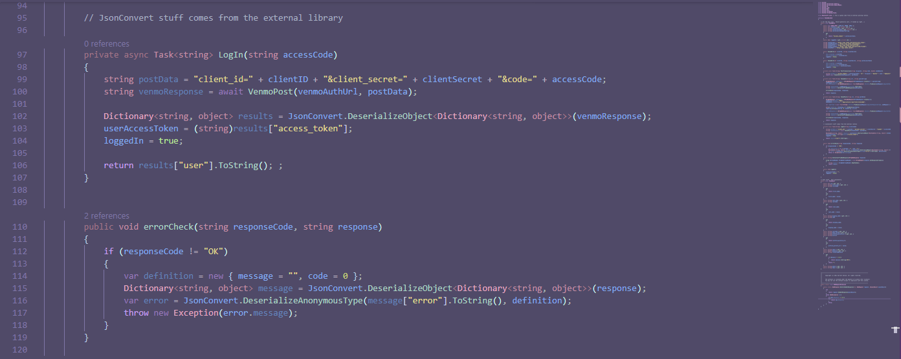
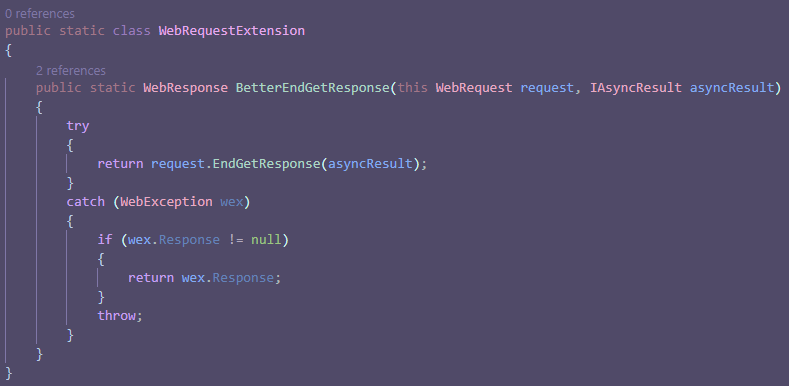
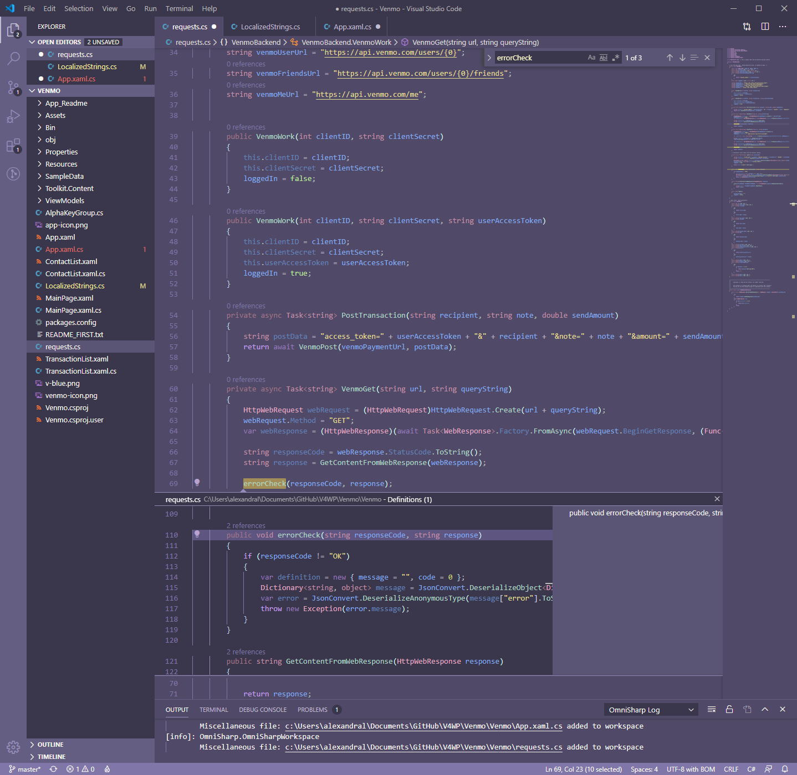

# Astrolize VSCode Theme
This theme combines a modified version of the UI theme from mintchipleaf's [fairy floss complete](https://github.com/mintchipleaf/fairyfloss-vscode) with a C# based code styling inspired by the [astrolokeys](http://astrolokeys.com/) keycap set by [cassidoo](http://www.twitter.com/cassidoo) and [sailorhg](http://www.twitter.com/sailorhg).

### C# styling with a purpose
Colors have different levels of saturation and tint to describe the scope and meaning of each part of the code. 

### Supports GitLens, Intellisense, and Peek in full color theme
